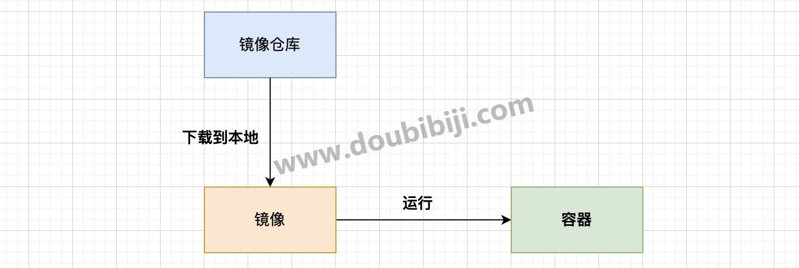

# 1 Docker简介

Docker现在被墙了，国内的镜像源也无法使用了，如果要使用，需要梯子。或者百度查找其他方式。

  

Docker是一个强大的容器化平台，让你能够更轻松地构建、部署和运行应用程序。

下面我们来学习 Docker。

  

## 1.1 Docker是什么

### 1 现在遇到的问题

- 每次部署一台服务器，需要安装各种依赖，配置各种环境，十分麻烦；
- 应用程序在我的电脑上运行完全没有问题，你说在你的电脑上不行，环境或配置不同导致的各种问题；
- 由于开发、测试和生产环境配置不一致，导致在生产环境中出现了在开发环境中未曾出现的bug；
- 一台服务器，硬件大部分时间处于闲置状态，资源被浪费；
- 等等...

  

### 2 虚拟机技术

使用虚拟机，我们可以使用同一个镜像文件，创建多个虚拟机，多个虚拟机的环境和配置是一模一样的，这样就不会存在多个虚拟机环境不一样的问题了。

### 3 Docker是怎么解决的

Docker 和虚拟机的思路是类似的，Docker 将**应用程序**及其**依赖项**打包成镜像，镜像包含了应用程序所需的所有内容，包括代码、运行时环境、系统工具、库和依赖项。开发者可以在本地构建镜像，并将其部署到任何地方，无需担心环境差异导致的问题。

虚拟机技术将镜像运行为一个个独立的虚拟机，Docker 引擎将镜像运行成一个个的容器，每个容器也是相互隔离，互不影响，确保了应用程序的安全性和稳定性。

**总的来说，Docker通过其容器化技术，将应用程序和运行它所需要的环境、依赖等打包成镜像，这样就没有环境问题了。**

举个栗子：

我们可以直接下载 Redis 镜像，一条语句将镜像运行起来，就可以直接使用了，不需要复杂的安装。我们的项目需要 Redis、MySql、JDK、RabbitMQ，我们可以直接将项目、Redis、Mysql、JDK、RabbitMQ 所有的这些打包成一个镜像，部署在各个机器上，就不需要一个个服务器安装环境了，听着是多么的顺耳。

### 4 Docker与虚拟机技术的不同

1. **虚拟化层次**

- **虚拟机技术：** 使用Hypervisor（如VMware、VirtualBox等）在物理服务器上创建多个完整的虚拟机。每个虚拟机都包含了自己的操作系统、内核和用户空间，相互独立。
- **Docker：** **利用宿主机的操作系统内核，并在其之上运行容器。容器与宿主机共享同一个操作系统内核，但各自拥有自己的用户空间。这使得容器更为轻量级。**

2. **资源利用方式**

- **虚拟机技术：** 每个虚拟机需要独立的操作系统，因此较为笨重，占用更多资源。多个虚拟机在同一物理机上运行时，会占用更多的内存和硬盘空间，随随便便20、30G的占用空间。
- **Docker：** **容器共享宿主机的操作系统，不需要额外的操作系统虚拟化，因此更为轻量级。它们利用相同的内核和资源，节省了资源，并允许更多容器在同一台机器上运行。**

3. **启动时间和性能**

- **虚拟机技术：** 虚拟机启动需要较长时间，因为需要启动完整的操作系统。
- **Docker：** **容器启动速度更快，因为它们不需要启动完整的操作系统，只需启动应用及其依赖项即可。**

4. **环境隔离**

- **虚拟机技术：** 虚拟机提供了完全隔离的环境，每个虚拟机都是相对独立的。
- **Docker：** 容器也提供了良好的隔离性，但与虚拟机相比，容器之间的隔离度略低。

  

**总体来说**，Docker相对于传统虚拟机技术更为轻量级、启动更快、资源利用更高效，**因为它利用了宿主机的操作系统内核**，并通过容器实现了更好的资源共享和隔离。使得应用程序能够更便捷、高效、一致地部署和运行，解决了环境一致性、快速部署、资源利用率、版本控制、隔离性等多个方面的问题。

## 1.2 Docker 三要素

在学习操作 Docker 之前，先介绍一下 Docker 中的基础概念。

- 镜像
- 容器
- 仓库

先用一句话解释：我们从仓库中下载镜像，然后运行镜像成为容器，一个镜像可以运行多次形成多个容器实例。

  

### 1 镜像（image）

镜像是一个静态的、只读的文件，其中包含了应用程序运行所需的所有内容，如代码、运行时环境、系统工具、库和依赖项。它是一个模板，用来创建容器。

使用一个镜像可以创建多个容器。所以用面向对象的方式来比喻的话，镜像就是类，容器就是使用类创建的一个一个实例。

  

### 2 容器（container）

容器是镜像的运行时实例，相当于面向对象中的一个个的对象实例。

当你运行一个镜像时，Docker会创建一个容器。它提供了一个隔离的环境，让应用程序可以在其中运行。

所以容器可以被理解为一个隔离的、独立的运行时环境，其中包含了应用程序及其运行所需的一切。

  

### 3 仓库（repository）

仓库就是存放镜像的地方，仓库分为公有仓库和私有仓库。

Docker 公司提供了公共的镜像仓库 `https://hub.docker.com`，里面提供了大量的镜像可以给我们给我们使用，我们也可以基于别人的镜像来创建我们自己的镜像。但是国内访问 `dockerhub` 速度比较慢，一般使用阿里云或网易云。

  

在使用 `docker run` 运行镜像的时候，docker 会检查本机是否存在镜像，如果存在就使用这个镜像运行为一个容器，而如果不存在，就会去 Docker Hub上下载，下载完成，再运行这个镜像。

我们一般不会直接运行一个本机不存在的镜像，我们一般会先搜索镜像，找到镜像后，将镜像下载下来，然后再通过镜像创建容器运行。