# 3 镜像命令

下面开始讲解镜像操作的一些命令，有了镜像才能运行镜像成为容器。

## 3.1 搜索镜像

从容器仓库下载镜像，首先需要搜索镜像，查看镜像是否存在。

命令：

```
# 搜索镜像
docker search 镜像名称

# 搜索镜像，同时显示显示的结果，只显示10条，不加参数，默认显示25条
docker search --limit 10 镜像名称
```


例如，搜索 `redis` 镜像：

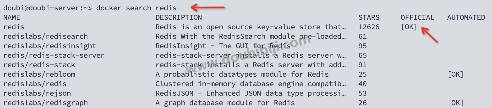

搜索会列出很多的镜像，分别是不同的账户、组织提交的，包括名称、描述等信息， `STARTS` 是受欢迎程度，用星星数量表示，`OFFICIAL` 表示是否是官方的镜像，`AUTOMATED` 表示镜像是否由自动化流程构建。

查看到上面的镜像列表，下载官方的镜像就可以了。

## 3.2 下载镜像

搜索到镜像以后，可以使用命令拉取镜像到本地：

命令：

```
# 拉取最新版本的镜像
docker pull 镜像名称

# 拉取指定版本的镜像：
docker pull 镜像名称:版本tag
```

例如下载搜索出来的 redis 镜像：

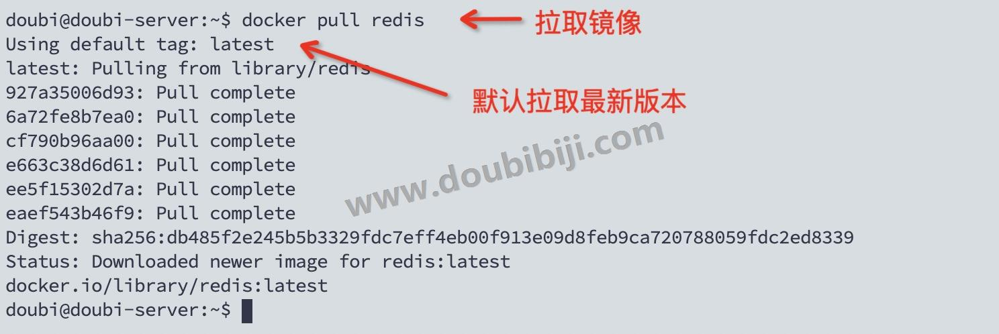

每个镜像都有 tag，也就是版本，如果不指定tag，默认拉取的就是最新版本。

我们可以登录 dockerhub，查看镜像有哪些版本。

例如在 dockerhub 上搜索 redis：

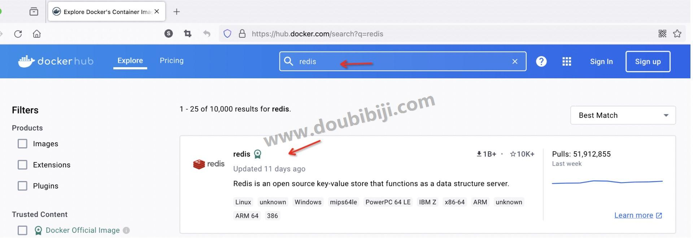

查看镜像详情，可以查看有哪些版本：

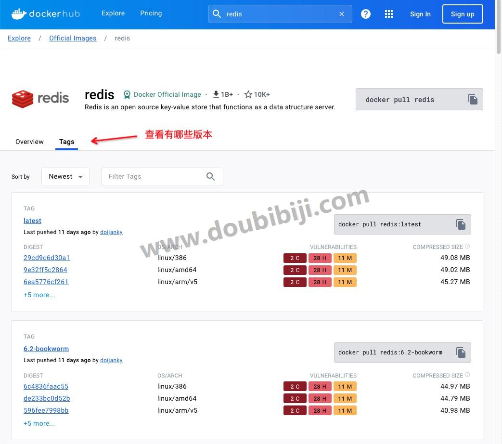

在拉取的时候，可以指定拉取的版本。

例如拉取 `6.0.20` 版本的 redis：

```
docker pull redis:6.0.20
```


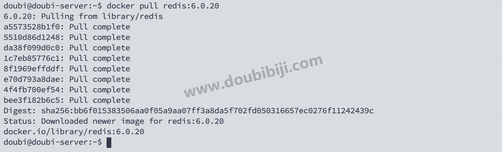

## 3.3 查看本地镜像

镜像下载完成了，可以查看本地有哪些镜像。

命令：

```
# 查看本地所有镜像
docker images

# 查看本地所有镜像，包括中间层（intermediate layers）。
docker images -a
```

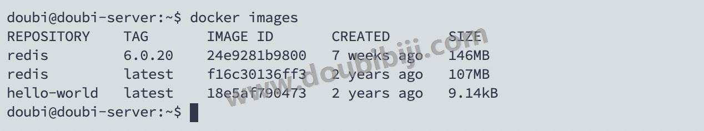

显示本地的镜像信息中，包含了镜像的名称、版本标签、镜像ID，什么时候创建的，镜像的大小。

上面的 hello-world 镜像是安装 docker 的时候，运行的 hello-world 镜像。

  

查看镜像命令的其他参数方式：

```
# 只显示镜像的ID
docker images -q

# 参数也可以联合使用
docker images -aq
```

只显示镜像的ID：

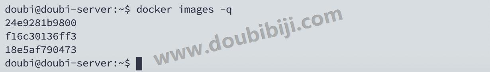

## 3.4 删除本地镜像

如果镜像以后不会再使用了，可以将其从本地删除。

在删除之前先查看一下本地的镜像，然后通过镜像的 ID 进行删除。

删除命令：

```
# 删除镜像
docker rmi 镜像ID

# 强制删除
docker rmi -f 镜像ID
```


例如删除 hello-world 镜像：

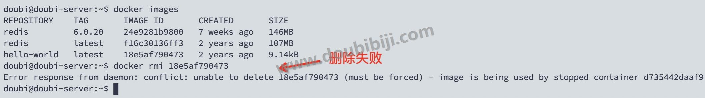

可以看到删除失败，这是为什么呢？

这是因为还存在以这个镜像创建的容器。我们要删除镜像，需要先删除用这个镜像创建的容器（删除容器后面再讲），或者使用强制删除。

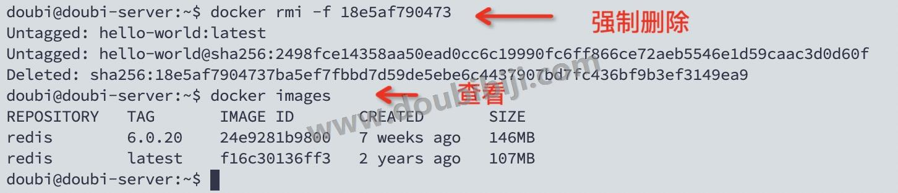

  

删除镜像命令还有一些其他的参数方式：

```
docker rmi 镜像名称            # 只会删除最新版本的镜像
docker rmi 镜像名称:版本tag     # 删除指定版本的镜像
docker rmi 镜像ID1 镜像ID2     # 删除多个
docker rmi -f $(docker images -qa)    # 删除所有镜像，慎用或不用，docker images -qa是获取到镜像的ID
```

举个栗子，根据名称删除：

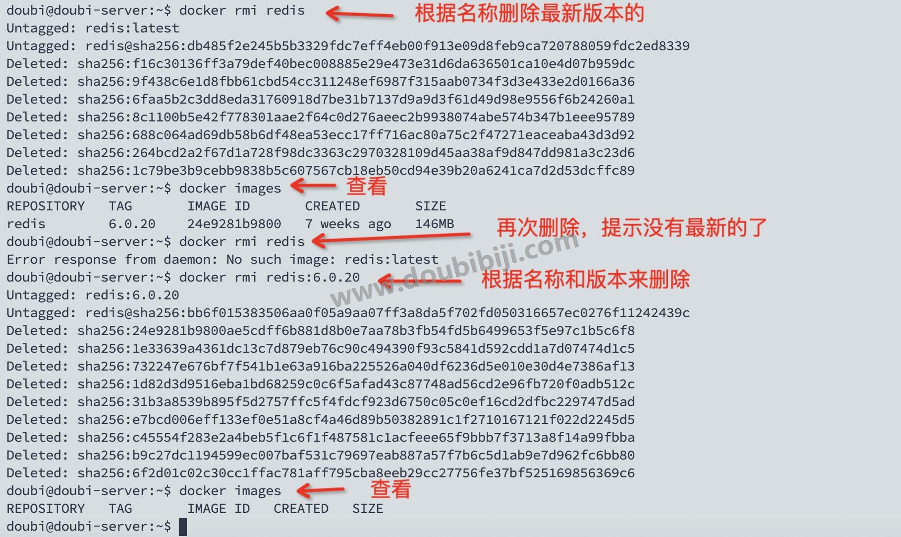

## 3.5 查看镜像容器数据卷的占用空间

我们可以查看 Docker 系统资源使用情况，以及各个镜像、容器和数据卷所占用的空间。

命令：

```
docker system df
```

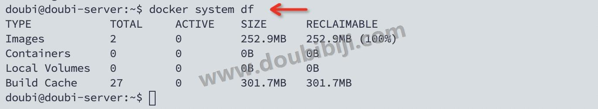

`docker system df` 命令会列出以下四种类型的资源占用：

1. **Images**：所有镜像占用的空间，包括拉取的镜像、本地构建的镜像。
2. **Containers**：容器的数量、和占用的空间。
3. **Local Volumes**：本地数据卷的空间。
4. **Build Cache**：镜像构建过程中，产生的缓存数据。

## 3.6 导入和导出镜像

可以将镜像导出到本地，然后再将镜像导入到其他的机器。

###  1 导出镜像

使用 `docker save` 命令将本地的 Docker 镜像保存为一个 tar 文件。

```
docker save -o /path/to/your_image.tar your_image_name:tag
```

例如，如果你的镜像名为 `myapp`，标签为 `latest`，并且你想保存到当前目录下的 `myapp.tar` 文件中，你可以运行：

```
docker save -o myapp.tar myapp:latest
```


###  2 导入镜像

可以使用 `docker load` 命令将镜像文件的 `tar` 包导入。

```
docker load -i /path/to/your_image.tar
```