# 4 容器命令

我们已经学会了镜像命令，可以将容器下载到本地了，下面开始学习如何通过镜像来创建容器。

## 4.1 启动容器

下面以 Ubuntu 镜像为例，也就是说我们在 Docker 中安装一个 Ubuntu。

话说现在我的主机已经是 Ubuntu 了，在 Ubuntu 中通过 Docker 再安装 Ubuntu 是不是有病，要做的事情直接在主机中做得了呗，这样做不是脱裤子放屁吗？

这里只是演示容器的使用，另外这样做也不是完全没有意义，你想，你现在只有一个 Linux 主机用来部署你的系统，那么只有一个节点，如果要发布新版本，那你只能将你的服务停掉了。而如果我在当前 Ubuntu 系统中通过 Docker 创建 Ubuntu 容器，我可以创建多个Ubuntu 容器，那就相当于我有了多个节点，再使用负载均衡，这样我在更新系统的时候，可以保证有一个节点运行，从而保证服务一直运行。当然这些都是后话。

另外这里在 Docker 中不一定非得使用 Ubuntu 镜像和容器，使用 CentOS 镜像也行，你自己开心。


好了，废话不多说。

首先拉取 Ubuntu 镜像：

```
# 拉取Ubuntu镜像
docker pull ubuntu
```

可以看到 Docker 中的 Ubuntu 体积很小，这是因为 Ubuntu 镜像是精简过的最小系统镜像，它只包含了运行 Ubuntu 所需的最小软件包集合。

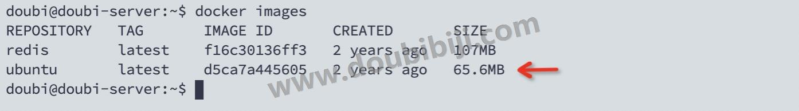

  

容器下载完成，可以通过镜像启动 Ubuntu 容器了：

```
# 启动容器，并指定名称
docker run -it --name my-ubuntu ubuntu /bin/bash

# 也可以不起名字，随机名字，新版本也可以不写/bin/bash
docker run -it ubuntu
```


解释一下上面的命令：

- `docker run`: Docker命令用于运行一个新容器。
- `-it`: 这是两个选项的组合。`-i` 代表交互模式，使容器保持打开状态并等待用户命令输入；`-t` 分配一个伪终端或终端，使输入可见。
- `--name my-ubuntu`: 这个选项给容器指定一个名称，名字你自己起，这里是`my-ubuntu`，该参数是可以省略的，省略后系统会随机生成一个名字。
- `ubuntu`: 这是要使用的镜像名称，即Ubuntu操作系统，使用的是最新版本，如果要使用指定的版本需要使用 `镜像名称:版本tag`，例如 `ubuntu:18.0.2`。
- `/bin/bash`: 这是在容器启动后要执行的命令。在这种情况下，它启动了Bash shell，允许你在容器内部进行交互式操作，其实这个是可以省略的，因为不加 `/bin/bash`，会启动一个默认的 shell。对于 Ubuntu 镜像，这个默认 shell 通常是 Bash shell。

启动容器完成：

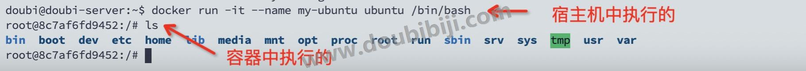

可以看到启动容器后，**主机名称变了，直接进入的容器**，容器就是一个精简版本的 Ubuntu。

这里进入到的是 Ubuntu 容器，其实进入到其他的容器，例如是 redis 容器，也能在根目录下看到类似的目录，因为**每个容器都可以看作是一个简易版的 Linux 环境（包括root用户权限、进程空间、用户空间和网络空间）和运行在其中的应用程序。**

`docker run -it ubuntu` 命令是可以运行多次的，那么就会产生多个 Ubuntu 容器实例。

## 4.2 退出和进入容器

刚才已经进入到容器内部了，现在退出容器。

退出容器有两个命令，命令是在容器中执行的：

```
# 直接退出容器，容器会停止
exit    

# 退出容器，容器不会停止
Ctrl + p + q  
```

  

如果再想进入正在运行的容器，可以使用 `docker exec` 或 `docker attach` 命令：

```
# 进入容器
docker exec -it 容器ID或名称 /bin/bash

# 进入容器
docker attach 容器ID或名称
```

**推荐使用 `docker exec` 命令**。因为 `docker attach` 会直接进入容器启动命令的终端，不会启动新的进程，所以用 `exit` 退出，会导致容器停止；而 `docekr exec` 是现在容器中打开新的终端，是启动了新的进程，时候用 `exit` 退出容器，不会导致容器停止。

## 4.3 查看容器

容器已经启动了，可以在宿主机上，查看所有正在运行的容器：

```
# 查看运行中的容器
docker ps
```

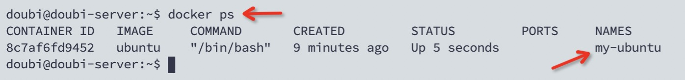

显示的信息会列出容器的ID、使用的镜像、创建的时间和状态等信息。

  

查看所有的容器，包括停止的：

```
# 查看所有容器，包括停止的
docker ps -a
```

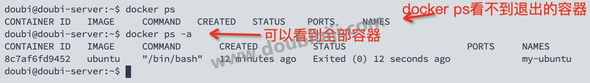

上面是最常用的，还有一些其他命令：

```
# 查看最近创建的容器
docker ps -l

# 查看容器，只显示容器编号
docker ps -q

# 查看最近n个创建的容器
docker ps -n 5  # 查看最近创建的5个容器
```

## [#](https://www.doubibiji.com/Docker-Basic/04-%E5%AE%B9%E5%99%A8%E5%91%BD%E4%BB%A4.html#_4-4-%E5%81%9C%E6%AD%A2%E5%AE%B9%E5%99%A8) 4.4 停止容器

正在运行的容器，可以使用 `docker stop` 命令停止：

```
# 停止容器
docker stop 容器ID/名称
```

举个栗子：


  

还有一个强制停止容器的命令，用的不多，了解一下：

```
# 强制停止容器
docker kill 容器ID/名称
```

`docker stop` 和 `docker kill` 的区别：

`docker stop`比较温柔，它会给容器发送一个TERM信号，给容器充足时间（默认10秒）保存数据，让容器自动安全停止运行，超时后再给系统发送SIGKILL的系统信号强行kill掉进程，最后转变为stop状态。而`docker kill`则比较生猛，它会直接给系统发送SIGKILL的系统信号强行kill掉进程。

## 4.5 启动已经停止的容器

已经被停止的容器，可以使用 `docker start` 命令重新启动：

```
# 启动已经停止的容器
docker start 容器ID/名称
```

举个栗子：

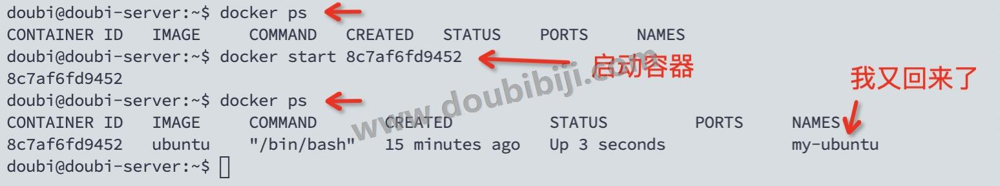

## 4.6 重启容器

正在运行的容器，可以使用 `docker restart` 命令进行重启：

```
# 重启容器
docker restart 容器ID/名称
```


命令都比较相似，就不演示了。停止的容器也可以使用这个命令进行启动。

## 4.7 删除容器

删除容器，使用如下命令：

```
# 删除已停止的容器
docker rm 容器ID/名称

# 强制删除容器，运行中的也可以删除
docker rm -f 容器ID/名称
```


如果是运行中的容器使用 `docker rm 容器ID/名称` 命令删除会失败，需要 `-f` 参数进行强制删除。

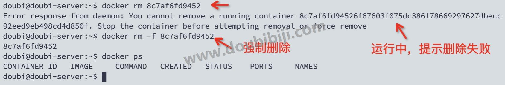

  

如果要删除全部容器，可以使用如下命令，了解一下，除非吃饱了撑的不要使用，后果自负：

```
# 删除全部容器
docker rm -f $(docker ps -a -q)
# 或者
docker ps -a -q | xargs docker rm
```


## 4.8 守护式容器

Docker 的容器有一些区别：有些容器是为交互式会话设计的，例如 Ubuntu 容器、CentOS 容器，需要在前台运行以便与用户进行交互，叫**交互式容器**；而有些容器则适合在后台运行，例如 redis，默默在后台工作，提供服务或执行长时间任务就行了，叫**守护式容器**。

对于交互式容器，我们需要使用 `-it` 指定与容器进行交互；

而对于守护式容器，我们需要使用 `-d` 指定容器在后台运行，否则一个 Ctrl+c，容器就退出了。

举个栗子：

首先拉取 redis 镜像

```
# 拉取 redis 镜像
docker pull redis
```


然后运行 redis 镜像：

```
# 以后台方式运行redis，并起了个名字叫myredis
docker run -d --name myredis redis
```

上面的是以后台的方式启动 redis 容器，查看运行的容器：

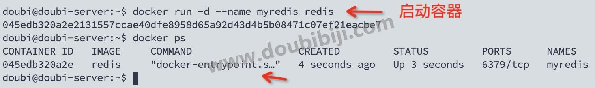

可以看到 redis 成功运行，但是如果你以 -d 的方式启动 Ubuntu 或 CentOS 容器，`docker run -d ubuntu` ，运行完成，查看运行中的容器发现没有对应的容器，因为 Ubuntu 和 CentOS 容器是交互式容器，没有前台进程就会退出，所以启动完就退出了。其实 redis 也可以使用交互式 `docker run -it redis` 方式启动，但是非常不推荐这么做。

## 4.9 端口映射

上面我们已经使用了 `redis` 镜像创建了 `redis` 容器，但是此时还无法访问这个 `redis` 服务，原因是还没有做端口映射。

以前我们在 `Linux` 系统中部署 `redis`，一般使用的端口是 `6379`，所以访问主机的 `6379` 端口就可以访问到这个主机上的 `redis` 服务。

现在 `redis` 服务部署到 `docker` 容器中，那么如何通过访问主机访问到 `docker` 中的 `redis` 服务呢？

我们需要在启动容器的时候，将容器的端口映射到主机的端口上，这样就可以通过访问主机端口来访问到容器的端口，进而访问到docker中的服务。

举个栗子：

```
# 启动 redis 服务
docker run -d -p 6379:6379 --name myredis redis
```


`-p` 表示端口映射，前面的 `6379` 表示宿主机的端口号，后面的 `6379` 表示容器的端口号。

  

如果使用的命令是：

```
# 启动 redis 服务
docker run -d -p 8888:6379 --name myredis redis
```


上面的命令表示通过访问宿主机的 `8888` 端口可以访问到 `myredis` 容器的 `6379` 端口，进而访问到 `myredis` 容器中的 redis 服务。

通过上面的方式启动，就可以使用 redis 客户端，访问宿主机的 `8888` 端口，连接到 redis 服务了。

  

有的容器需要映射多个端口，例如我们给前面的 Ubuntu 容器映射端口：

```
docker run -it --name myUbuntu -p 80:80 -p 8080:8080 Ubuntu /bin/bash
```


在上面的命令中，在启动容器的时候，映射了两个端口，分别是80和8080。

## 4.10 重启策略

当我们的容器运行的过程中，因为某种原因退出，这个时候我们想容器能够重新启动，该如何设置呢？

我们可以在运行容器的时候，指定重启策略。

举个栗子：

```
docker run -d -p 6379:6379 --restart=always --name myredis redis
```


其中的 `--restart` 参数指定了重启的策略， `--restart` 可以设置为如下值：

- `no`：默认策略，在容器退出时不进行重启。
- `always`：无论容器退出状态如何，都会尝试重启容器。
- `on-failure`：只有在容器以非零状态码退出时才尝试重启容器。
- `unless-stopped`：在容器退出或守护进程重启时，始终重启容器，除非用户明确停止了容器。

  

如果容器已经启动了，可以使用 `update` 命令修改容器的重启策略：

```
docker update --restart=always <container_id>
```


在上述命令中，将 `<container_id>` 替换为你想要修改的容器的实际 ID 或名称。

## 4.11 查看容器日志

想要查看容器运行的日志，可以使用命令进行查看：

命令：

```
# 查看容器日志
docker logs 容器ID/名称
```

举个栗子：

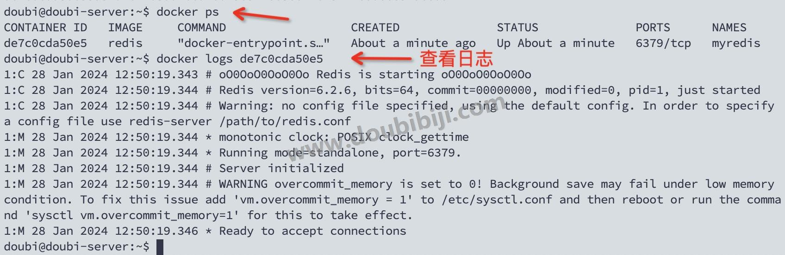

## 4.12 查看容器信息

查看容器信息可以使用 `docker inspect` 命令：

```
# 查看容器详细信息
docker inspect 容器ID/名称
```


`docker inspect` 是一个用于获取**容器**或**镜像**（也可以查看镜像）详细信息的命令。通过这个命令，可以查看容器的配置、网络设置、存储卷挂载等信息。使用该命令，可以更好地了解容器或镜像的运行状态和配置情况。

举个栗子：

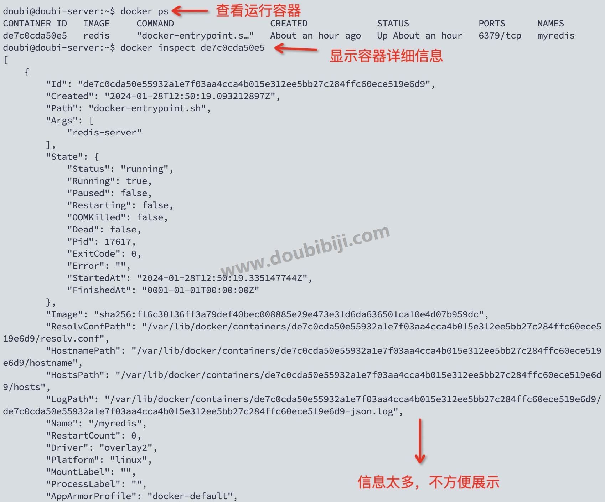

通过 `docker inspect` 命令可以查看到容器的详细信息（例如重启策略 `RestartPolicy`），现在这些信息体会不深，后面继续学习 docker，回过头来查看这些信息体会更深一些。

## 4.13 拷贝文件

我们有时候需要在宿主机和容器之间传输文件，使用 `docker cp` 命令，在宿主机和容器之间相互拷贝文件：

注意：是在宿主机中执行命令，不是容器中。

```
# 将宿主机的文件拷贝到容器
docker cp 宿主机路径 容器ID:容器内路径

# 将容器的文件拷贝到宿主机
docker cp 容器ID:容器内路径 宿主机路径
```

举个栗子：

从宿主机复制文件到容器：

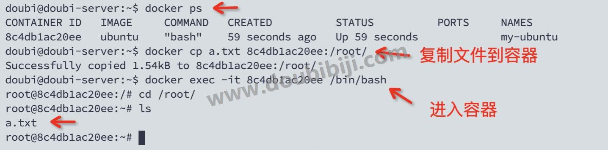

从容器复制文件到宿主机：

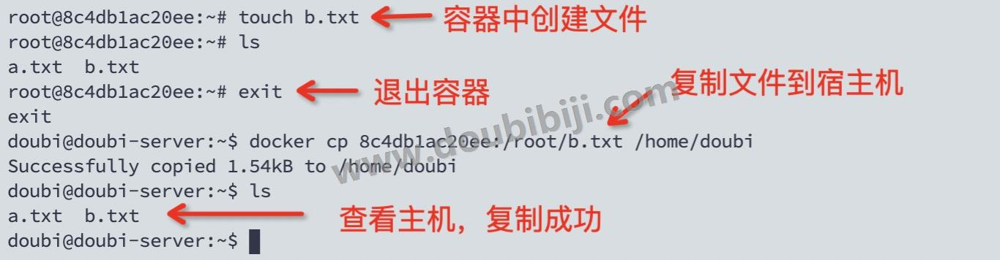

## 4.14 导入和导出容器

有时候我们需要备份容器或者将容器拷贝到其他的机器上，那么就可以将容器导出为 tar 包，然后在其他的机器上通过 tar 包恢复成镜像。

  

**导出**

导出可以使用 `docker export` 命令，将容器导出为一个 tar 文件。

命令：

```
# 导出容器
docker export 容器ID/名称 > 文件.tar
```

举个栗子：

下面将 Ubuntu 容器导出为 tar 包：

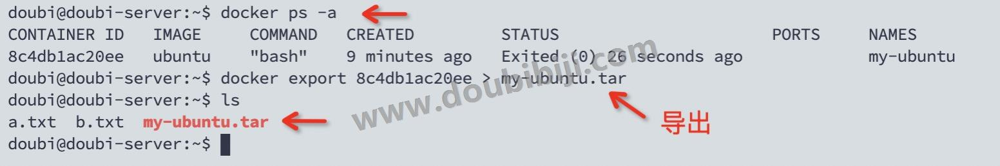

  

**导入**

导入可以使用 `docker import` 命令，将 tar 包中的内容创建为一个新的镜像。

命令：

```
# 从tar包导入为镜像
docker import 文件.tar 镜像名称:版本标签
```


举个栗子：

下面通过命令将 tar 包导入为一个新的 Ubuntu 镜像，然后使用新的镜像启动为一个容器：

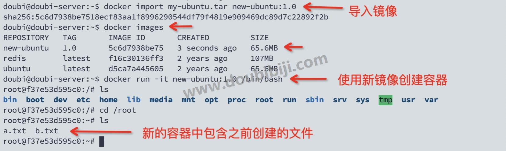