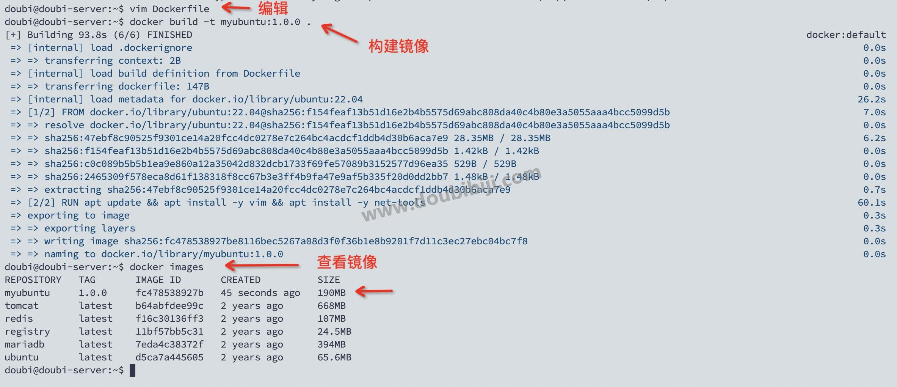
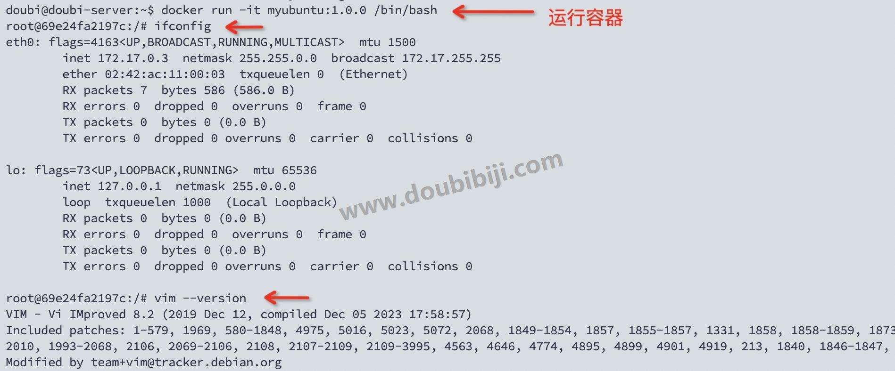
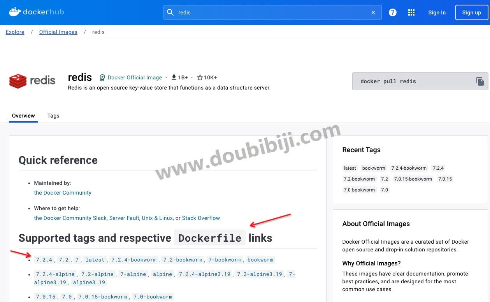
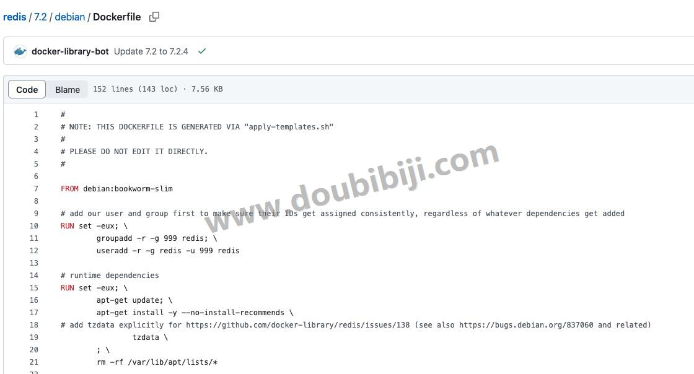
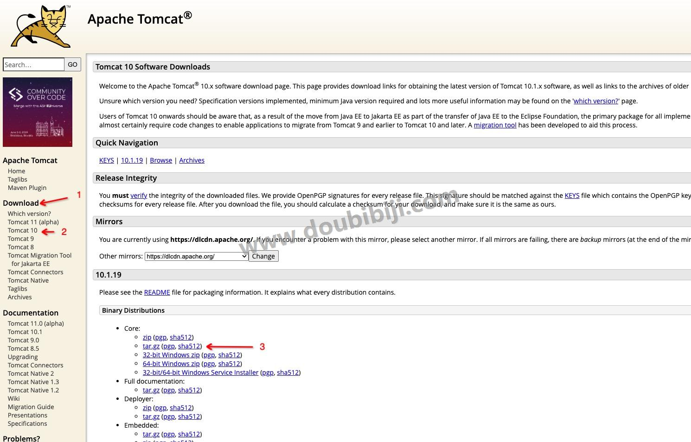
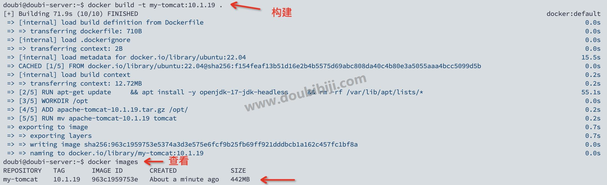
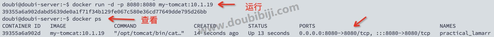
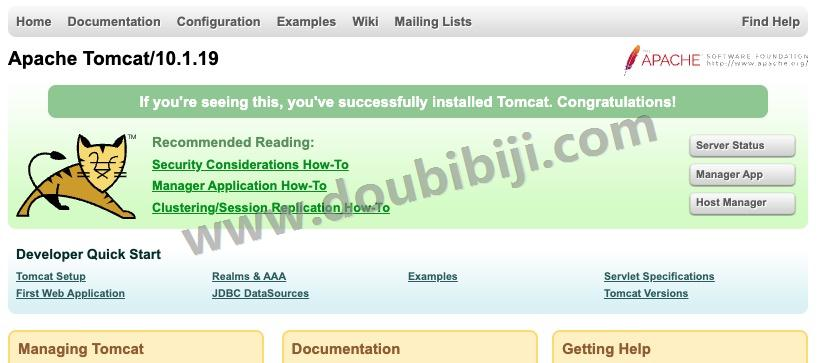

# 9 Dockerfile

Dockerfile 是做什么的？

我们前面说到，制作镜像的方法主要有两种方式：

- 使用 `docker commit` 命令；
- 使用 `Dockerfile` 文件。

但是使用 `docker commit` 命令很麻烦，每次都要进入容器修改容器然后提交。我们可以通过 Dockerfile 通过一条一条的指令和参数来构成脚本文件，通过脚本文件来生成镜像，这样就很方便。

  

下面就来讲解通过 Dockerfile 来编排镜像。

使用 `Dockerfile` 是构建镜像的步骤如下：

1、编写一个 Dockerfile 文件；

2、使用 `docker build` 命令运行脚本文件，构建成为一个镜像；

3、使用 `docker run` 命令运行镜像；

4、如果需要，可以使用 `docker push` 命令发布镜像到镜像仓库（DockerHub 、阿里云仓库等）。

  

##  9.1 使用Dockerfile构建镜像

在前面我们通过运行 Ubuntu 镜像生成一个容器，在容器中安装 vim 编辑器，然后使用 `docker commit` 命令生成一个新的镜像。

下面使用 `Dockerfile` ，基于 Ubuntu22.04，安装 `vim` 和 `ifconfig` 命令，生成一个新的 Ubuntu 镜像。

### 1 编写 Dockerfile 文件

随便在一个目录下创建一个文件，例如我在 `/home/doubi` 目录下，名称为 `Dockerfile`，名称是固定的，内容如下：

```
FROM ubuntu:22.04

# 更新 apt
RUN apt update

# 安装 vim
RUN apt install -y vim

# 安装 ifconfig
RUN apt install -y net-tools
```

`FROM` 是 Dockerfile 第一行非注释代码，表示我们的镜像是基于哪个镜像来创建的。

`RUN` 用于在构建镜像的时候运行 `Shell` 命令，这里运行了三条命令，用来安装 `vim` 和 `ifconfig` 命令。指令是很简单的。

**Dockerfile 中的命令的关键字必须是大写字母，#表示注释。**

  

但是上面的 Dockerfile 可以进行优化，因为构建镜像时，Dockerfile 的每⼀条 RUN 指令都会在镜像上构建⼀层，为了减⼩镜像⽂件⼤⼩，可以将多个 `RUN` 命令合并为一条命令，从而减少镜像的层数。

所以上面的 Dockerfile 可以改写为如下：

```
FROM ubuntu:22.04

# 安装 vim 和 ifconfig
RUN apt update && apt install -y vim && apt install -y net-tools
```


### 2 构建镜像

下面执行 `docker build` 命令，运行脚本文件，构建成为一个镜像：

```
docker build -t myubuntu:1.0.0 .      # 后面有一个"点"
```


- `docker build`：这是 Docker 的构建命令，用于根据 `Dockerfile` 中的指令创建 Docker 镜像；
  
- `-t myubuntu:1.0.0` ：指定构建的镜像的名称为myubuntu，同时设置版本标签为 1.0.0；
  
- `.` ：这个参数指定了 `Dockerfile` 所在的路径，`.` 表示当前目录。Docker 会在当前目录下寻找名为 `Dockerfile` 的文件，并根据其中的指令构建镜像。
  
  
  

构建需要一点时间，构建完成，可以看到在本地生成了镜像：



### 3 运行镜像

镜像已经生成了，下面运行一下使用 Dockerfile 生成的镜像，查看一下是否有 `vim` 和 `ifconfig` 。

运行镜像：

```
docker run -it myubuntu:1.0.0 /bin/bash
```

运行后，查看容器中是否有 `vim` 和 `ifconfig` 命令，可以看到我们自己的镜像已经包含了 `vim` 和 `ifconfig`。



  

上面使用 Dockerfile 构建镜像比使用 `docker commit` 构建镜像方便多了。

##  9.2 查看官方容器

我们之前使用的 Tomcat、Redis 等容器，在 dockerhub 上查看，其实这些容器也是使用 Dockerfile 来构建的。

例如在 dockerhub 上搜索 redis 容器，进入到容器详情页面，提供了 Dockefile 的链接：



  

点击链接可以跳转到容器的 Dockerfile 页面，查看容器 Dockerfile 的详细内容：



当然对于我们来说一般也不用编写这么复杂的镜像，只需要了解原理，看得懂简单的镜像编写即可。

##  9.3 Dockerfile 常用命令

上面我们实现了自定义的 Ubuntu 镜像构建，里面用到了 `FROM` 和 `RUN` 命令，在 Dockerfile 中还有一些常用的命令。

下面简单的介绍一下常用的命令。

###  1 FROM

`FROM` 指令指明构建的新镜像是基于哪个基础镜像，如果没有选择 tag，那么默认值为 latest。

语法：

```
FROM <image>:<tag>
```

举个栗子：

构建的镜像是基于 ubuntu22.04 来构建：

```
# 基于ubuntu22.04来构建镜像
FROM ubuntu:22.04
```

###  2 LABEL

`LABEL` 指令用于向镜像添加元数据，提供关于镜像的描述信息。这些标签可以包含有关项目、维护者、版本、许可证等信息。

语法：

```
LABEL <key>=<value> <key>=<value> <key>=<value> ...
```

举个栗子：

```
# 使用LABEL向镜像描述信息
LABEL version="1.0" maintainer="doubibiji@qq.com" description="My custom Docker image"
```


`LABEL` 指令可以省略，添加也没有实际的影响。

###  3 RUN

`RUN` 命令可以在构建镜像时执行命令。这个命令接收两种格式：`Shell` 和 `Exec`。

**Shell 形式**

语法：

```
RUN <command>
```

举个栗子：

构建的新镜像中我们想在 `/home/doubi` 目录下创建一个 `hello` 目录。

```
RUN mkdir -p /home/doubi/hello
```

也可以执行指令来安装软件、配置环境等。例如安装 `vim` 命令：

```
RUN apt update && apt install -y vim
```

  

**Exec 形式**

在 Exec 形式中，命令是一个数组，指定了可执行文件及其参数。这种形式适用于避免 Shell 字符串处理的一些潜在问题，同时也提供了更直观的命令执行方式。

示例：

```
RUN ["apt", "update", "&&", "apt", "install", "-y", "vim"]
```


这是与上述 Shell 形式等效的命令，使用哪种格式，看你自己，我还是喜欢 `Shell` 格式的。

**注意：`RUN` 命令会在执行 `docker build` 命令的时候执行。每⼀条 RUN 指令都会在镜像上构建⼀层，为了减⼩镜像⽂件⼤⼩，可以将多个 `RUN` 命令合并为一条命令，从而减少镜像的层数。合并会降低可读性，需要根据实际情况权衡可读性和减小层数之间做个平衡。**

###  4 COPY

`COPY` 指令可以拷贝文件或目录到镜像中。

语法：

```
COPY <src> <dest>
```

举个栗子：复制 jar 包到 镜像文件中：

```
# 将hello-springboot-0.0.1-SNAPSHOT.jar复制到镜像文件中，目标名称为app.jar
COPY hello-springboot-0.0.1-SNAPSHOT.jar app.jar
```


###  5 ADD

`ADD` 指令可以拷贝文件或目录到镜像中，类似于 `COPY`，但支持更多功能。

语法：

```
ADD <src> <dest>
```


`src` 可以是一个本地文件或者是一个本地压缩文件，压缩文件会自动解压。还可以是一个 `url`，如果把 `src` 写成一个 `url`，那么 `ADD` 就类似于 `wget` 命令，然后自动下载和解压。

举个栗子：

通过 url 下载文件到镜像的 `/tmp/` 目录下，并解压：

```
ADD https://example.com/file.tar.gz /tmp/
```

### 6 WORKDIR

`WORKDIR` 命令用于设置工作目录，此后的 RUN、CMD、ENTRYPOINT、COPY 、AND 等命令将在这个工作目录下执行。

语法：

```
WORKDIR 路径
```

`WORKDIR` 命令可以多次使用，每次使用都会改变当前工作目录。

举个栗子：

```
WORKDIR /path/to/directory
```

如果设置的目录不存在会自动创建。

###  7 ENV

`ENV` 命令用于在构建镜像过程中设置环境变量，这些环境变量是一直存在于镜像中的。

语法：

```
# 格式1
ENV key value
# 格式2：可以使用=
ENV key1=value1 key2=value2
```

举个栗子：

```
# 设置一个名为 "WORK_HOME" 的环境变量
ENV WORK_HOME /home/doubi

# 引用WORK_HOME环境变量
WORKDIR $WORK_HOME
```


环境变量可以在后续的RUN、WORKDIR命令中使用。

如果在 Dockerfile 中使用 `ENV` 指令设置了环境变量，那么在使用 `docker run` 命令的时候，可以使用 `-e` 参数覆盖 Dockerfile 中设置的值。这在需要动态配置容器时非常有用，比如根据运行时的条件来设置不同的环境变量值。

举个栗子：

```
# 设置Spring Boot配置文件环境变量，默认为dev  
ENV SPRING_PROFILES_ACTIVE=prod  
```

在运行容器的时候，可以使用 `-e` 参数覆盖 Dockerfile 中的环境变量：

```
docker run -d -e SPRING_PROFILES_ACTIVE=dev -p 8080:8080 my_image
```


### 8 ARG

`ARG` 命令与 `ENV` 命令作用一样，和 `ENV` 命令不同的是：这些变量只在构建过程中有效，构建完成后不会被保留在最终的镜像中。

语法：

```
ARG key[=value]
```

- `name` ：参数的名称。
- `default_value` ：参数的默认值，可以缺省。

构建过程中，`ARG` 定义的参数可以用于在 Dockerfile 中的各个指令中，并在 `docker build` 命令中被覆盖。它对于在构建时动态地传递参数非常有用。

举个栗子：

```
# 定义构建参数  
ARG VERSION=latest  
ARG BUILD_DATE  
  
# 使用构建参数设置环境变量  
ENV APP_VERSION=$VERSION  
ENV BUILD_DATE=$BUILD_DATE 
```

在构建的时候，可以通过 --build-arg 传递参数：

```
# 可以传递多个参数
docker build --build-arg VERSION=1.0.0 --build-arg BUILD_DATE=$(date) -t my-image .
```


### 9 EXPOSE

`EXPOSE` 命令的作用就是对外暴漏端口。但是并不是打开端口，而是声明，实际还是在运行 `docker run` 命令的时候，通过 `-p` 参数指定。

语法：

```
EXPOSE <port> [<port>/<protocol>...]
```

- `<port>`：要暴露的端口号。
- `<protocol>`：可选参数，指定要使用的协议（如 `tcp` 或 `udp`）。

举个栗子：

```
# 暴露80端口
EXPOSE 80

# 暴露多个端口
EXPOSE 80 443

# 指定端口和协议
EXPOSE 8080/tcp
```

可以一次指定多个端口，或者指定多个端口和协议的组合。

### 10 CMD

`CMD` 命令用于为容器指定默认的执行命令或应用程序。当容器启动时，这个命令将被执行，可以用来启动容器中的应用程序。

什么意思，是不是有点蒙？

前面的 `RUN` 命令是在构建镜像的时候执行，也就是执行 `docker build` 命令的时候执行；而 `CMD` 命令是启动容器的时候执行，也就是执行 `docker run` 命令的时候执行。

查看官方的 Tomcat 镜像的 Dockerfile，可以看到最后一行脚本是：

```
CMD ["catalina.sh", "run"]
```

`catalina.sh run` 命令也就是启动 Tomcat 的命令。如果没有这行命令，在使用 `docker run` 命令启动 Tomcat 容器的时候，容器是启动起来了，但是容器中的 Tomcat 没有被启动。所以 `CMD` 命令可以用来启动容器中的应用程序的。

**如果在 Dockerfile 中存在多个 `CMD` 命令，只有最后一个会生效。**

  

`CMD` 命令的语法和 `RUN` 命令相似，也支持 `Shell` 和 `Exec` 两种格式：

```
# Shell格式
CMD <command>

# Exec格式
CMD ["参数1", "参数2", ...]
```


需要注意：**CMD中定义的命令会被 docker run 之后的参数替换**。

什么意思呢？看下面的指令：

```
docker run -it -p 8080 tomcat /bin/bash
```

上面的 `/bin/bash` 就是 docker run 之后的参数，会替换掉 Tomcat Dockerfile文件中的 `CMD ["catalina.sh", "run"]` 命令中的参数，导致容器启动了，但是 Tomcat 没有被启动，所以一定要注意。

### 11 ENTRYPOINT

`ENTRYPOINT` 命令用于指定容器启动时执行的命令，它与 `CMD` 命令有些相似。同样在一个 Dockerfile 中只能有一个 `ENTRYPOINT` 命令。如果在 Dockerfile 中定义了多个 `ENTRYPOINT`，则只有最后一个 `ENTRYPOINT` 命令会生效，而之前的将被忽略。

`ENTRYPOINT` 命令也支持 `Shell` 和 `Exec` 两种格式：

```
# Shell格式
ENTRYPOINT <command>

# Exec格式
ENTRYPOINT ["参数1", "参数2", ...]
```


但是 `ENTRYPOINT` 和 `CMD` 有一些关键的区别。

前面说到 **CMD中定义的命令会被 docker run 之后的参数替换**，但是`ENTRYPOINT` 命令不会。如果用户在运行容器时提供了命令，那么这些用户提供的命令将作为参数传递给 `ENTRYPOINT` 指定的命令。

举个栗子，比如我们的 Dockerfile 中有如下命令：

```
ENTRYPOINT ["echo", "Hello, Docker!"]
```

那么在使用 `docker run` 命令运行镜像的时候，后面添加了 "Custom command" 参数：

```
# 启动容器
docker run -it my-image "Custom command"
```

那么启动容器执行的指令将会是 `echo "Hello, Docker!" "Custom command"`。

  

`ENTRYPOINT` 可以和 `CMD` 一起使用，当需要使用变参的时候，可以使用 `CMD` 给 `ENTRYPOINT` 传递参数，此时的 `CMD` 作用发生了变化，不再是运行命令，而是将 `CMD` 的内容作为参数传递给 `ENTRYPOINT` 命令。

举个栗子：

```
FROM nginx

ENTRYPOINT ["nginx", "-c"]
CMD ["/etc/nginx/nginx.conf"]
```

上面的 Dockerfile，在运行容器的时候，相当于执行了指令 `nginx -c /etc/nginx/nginx.conf`，`CMD` 的内容作为参数传递给 `ENTRYPOINT` 命令。

如果想要在运行容器的时候，传递参数，覆盖 `/etc/nginx/nginx.conf`，使用另外一个配置文件，那么可以在启动容器的时候指定参数：

```
docker run -it mynginx -c /etc/nginx/new.conf
```

那么相当于执行了指令 `nginx -c /etc/nginx/new.conf` 。

### 12 VOLUME

`VOLUME` 命令用来做匿名挂载，在启动容器时忘记挂载数据卷，会自动挂载到匿名卷。

语法：

```
# 方式1
VOLUME <路径>

# 方式2
VOLUME <路径1> <路径2>

# 方式3
VOLUME ["<路径1>", "<路径2>"...]
```


一个 Dockerfile 可以包含多个 `VOLUME` 命令，指定多个需要持久化存储的目录。

举个栗子：

```
FROM ubuntu:latest
VOLUME /data
VOLUME /config
```


在运行容器时，你可以使用 `-v` 选项来将宿主机上的目录挂载到 `VOLUME` 声明的目录上。例如：

```
docker run -v /host/data:/data -v /host/config:/config my-image
```


## 9.4 构建Tomcat镜像

dockerhub 上已经有了 Tomcat 镜像了，这里我们只是为了学习 Dockerfile 的常用命令，使用上面的命令构建我们自己的 Tomcat 镜像。

### 1 准备文件

查看 Tomcat 官方镜像的 Dockerfile，100多行很复杂，因为官方镜像是在 Dockerfile 中下载和安装 Tomcat，这里我们简单一点，先下载好 Tomcat 安装包，然后将安装包使用 `ADD` 命令将安装包拷贝到镜像中。

所以首先在 Tomcat 官网下载安装包，官网： `https://tomcat.apache.org/` 。

这里我下载 Tomcat10 的 `apache-tomcat-10.1.19.tar.gz` 包。



### 2 编写Dockerfile

下面开始编写 Dockerfile：

```
# 设置基础镜像为 Ubuntu 22.04  
FROM ubuntu:22.04  
  
# 设置环境变量，防止在安装时有提示  
ARG DEBIAN_FRONTEND=noninteractive  
  
# 更新软件包列表  
RUN apt-get update \  
    # 安装jdk  
    && apt install -y openjdk-17-jdk-headless \
    # 安装软件包之后清理APT缓存
    && rm -rf /var/lib/apt/lists/*
  
# 设置工作目录  
WORKDIR /opt  
  
# 使用 ADD 命令拷贝并解压 Tomcat 压缩包  
ADD apache-tomcat-10.1.19.tar.gz /opt/  
  
# 重命名解压后的目录
RUN mv apache-tomcat-10.1.19 tomcat
  
# 暴露 Tomcat 默认的端口  
EXPOSE 8080  
  
# 启动 Tomcat  
CMD ["/opt/tomcat/bin/catalina.sh", "run"]
```


上面的 RUN 命令如果太长，可以使用 `\` 进行换行。

Tomcat 需要 JDK，所以先安装 JDK，然后将 `apache-tomcat-10.1.19` 添加到镜像中，然后启动 Tomcat，学了 Dockerfile 常用的命令，上面的脚本还是容器看得懂的。

### [#](https://www.doubibiji.com/Docker-Adv/01-Dockerfile.html#_3-%E6%9E%84%E5%BB%BA%E9%95%9C%E5%83%8F) 3 构建镜像

Dockerfile 编写完成了，下面执行 `docker build` 命令，来构建镜像。

这里需要将 `apache-tomcat-10.1.19.tar.gz` 包和 Dockerfile 放在宿主机的同一个目录下，然后执行 `docker build` 命令：

```
docker build -t my-tomcat:10.1.19 .     # 后面有个点
```

构建如下：



### [#](https://www.doubibiji.com/Docker-Adv/01-Dockerfile.html#_4-%E8%BF%90%E8%A1%8C%E5%AE%B9%E5%99%A8) 4 运行容器

镜像已经构建完成，下面运行容器：

```
docker run -d -p 8080:8080 my-tomcat:10.1.19
```

运行后，可查看正在运行的容器：



### [#](https://www.doubibiji.com/Docker-Adv/01-Dockerfile.html#_5-%E8%AE%BF%E9%97%AEtomcat) 5 访问Tomcat

运行容器后，可以访问宿主机的8080端口，来访问 Tomcat 了：



完成！