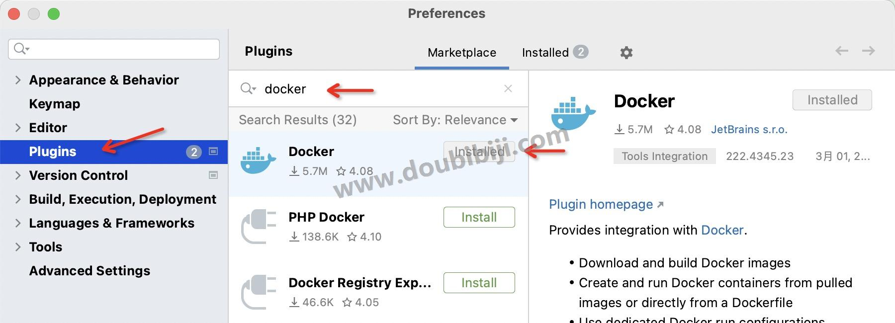
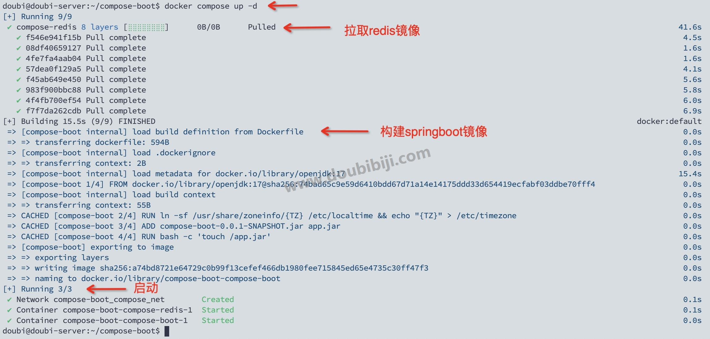
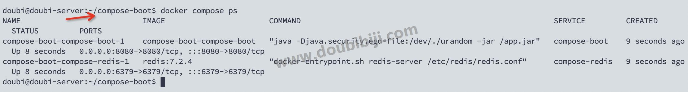

# 13 Docker Compose

先说一下我们现在遇到的问题：

在实际的使用环境中，可能应用会很复杂，尤其是微服务架构中，一个应用系统可能包含多个微服务，每个微服务可能需要部署多个实例。手动启停每个微服务既低效又需要大量维护工作。多个容器之间还可能存在依赖关系，需要按照指定的顺序启动，所以手动维护这些容器会变得复杂和繁琐，没有效率还可能出错。

所以现在就需要一个工具，来进行多容器的管理和编排，Docker Compose 来了。

##  13.1 Docker Compose简介

Docker Compose 是 Docker 公司推出的一个工具，用于简化多容器应用程序的定义、运行和管理。通过一个 YAML 配置文件（通常是 `docker-compose.yml`），用户可以定义应用程序的各种服务、网络和卷，并通过一条命令就可以启动、停止一组相关联的多个容器。

##  13.2 Docker Compose安装

在 Docker 旧版本中，Docker Compose 要另外安装，现在的 Docker 中已经默认集成了 Docker Compose。

使用 `docker compse version` 命令可以查看到版本信息：


##  13.3 Docker Compose使用

下面演示一下 Docker Compose 的使用。

Docker Compose 主要是对多个容器的同时启动和停止，所以我们就用一个例子同时启停两个应用，至于同时启动3个、4个，100个也是一样的。

好了，假设有一个 SpringBoot 应用，需要部署在 Docker 容器中，同时它还需要依赖一个 Redis 容器。

他们之间是存在依赖关系的，因为 SpringBoot 项目要访问 Redis 服务，需要先启动 Redis 容器，然后才能启动 SpringBoot 的应用程序容器，否则 SpringBoot 项目启动会报错。

下面使用 Docker Compose 完成上面的功能，一键启动两个容器。

> 其实这里通过这个样例来演示 Docker Compose 是有点不合适的，因为一般在实际使用的过程中，我们的 Redis 服务或者是 MySQL 服务启动后就不会动了，是不跟随业务服务器来进行启动和停止的。一般会有订单服务、支付服务、业务服务这样的多个微服务，可以通过 Docker Compose 来控制这些相关联的微服务同时启停。这样但是这里为了演示方便，使用了这个例子。主要是演示 Docker Compose 是如何控制多个容器进行启动和停止的，并控制容器之间的依赖关系。

###  1 准备SpringBoot项目

首先准备 SpringBoot 项目，后面使用 Dockerfile 将这个项目的 jar 包生成一个 Docker 镜像。

现在这个项目主要使用 Controller 提供两个接口，一个是通过接口往 Redis 中添加数据，一个从 Redis 中获取数据。

代码没那么重要，重要是演示项目的部署，项目结构：


上面docker 目录下的 `docker-compose.yaml` 和 `Dockerfile` 是后面的步骤编写的。

  
这里简单列一下代码，如果不懒得搭项目可以下载我的 [源码和jar包 (opens new window)](https://download.csdn.net/download/Satur6ay/88896571) ，其中包含了源码和生成的 jar 包。

Controller：

```
package com.doubibiji.composeboot.controller;

import com.doubibiji.composeboot.service.ICacheService;
import org.springframework.beans.factory.annotation.Autowired;
import org.springframework.web.bind.annotation.GetMapping;
import org.springframework.web.bind.annotation.RequestMapping;
import org.springframework.web.bind.annotation.RestController;

@RestController
@RequestMapping("/cache")
public class CacheController {

    @Autowired
    private ICacheService cacheService;

    @GetMapping("/add")
    public String addValue(String key, String value) {
        cacheService.cache(key, value);
        return "success";
    }

    @GetMapping("/get")
    public String addValue(String key) {
        String value = cacheService.get(key);

        if (null == value) {
            return "没有从缓存中获取到值, key:" + key;
        }
        else {
            return "获取到值，key:" + key + ", value:" + value;
        }
    }
}
```

Service：

```
package com.doubibiji.composeboot.service.impl;

import com.doubibiji.composeboot.service.ICacheService;
import lombok.extern.slf4j.Slf4j;
import org.springframework.beans.factory.annotation.Autowired;
import org.springframework.data.redis.core.StringRedisTemplate;
import org.springframework.stereotype.Service;

@Slf4j
@Service
public class CacheServiceImpl implements ICacheService {

    @Autowired
    private StringRedisTemplate redisTemplate;

    /**
     * 缓存信息
     */
    public void cache(String key, String value) {
        log.info("缓存 key:{}, value:{}", key, value);
        redisTemplate.opsForValue().set(key, value);
    }

    /**
     * 从缓存中获取信息
     */
    public String get(String key) {
        log.info("从缓存获取 key:{}", key);
        String value = redisTemplate.opsForValue().get(key);
        return value;
    }
}
```

application.yaml

```
server:
  port: 8080

spring:
  data:
    # redis 配置
    redis:
      host: compose-redis   # 这里是 redis 容器服务
      port: 6379
      password: 123456
      database: 0
      jedis:
        pool:
          max-active: 10
          max-idle: 5
          max-wait: 3000
          min-idle: 2
```


**注意：上面项目中的 Redis 服务的地址，指定的是 redis 容器服务的名称，这里记住了，需要与后面的容器配置相同。**

然后将项目打成 jar 包：`compose-boot-0.0.1-SNAPSHOT.jar`

###  2 编写项目的Dockerfile

SpringBoot 项目需要使用容器部署，所以需要使用 Dockerfile 来将项目打成镜像，编写 Dockerfile。

SpringBoot 项目的 Dockerfile 如下：

```
# 使用基础的 Java 17镜像
FROM openjdk:17

# 对外暴露的端口是8080
EXPOSE 8080

# 设置环境变量来指定时区
ENV TZ=Asia/Shanghai
# 将时区文件复制到容器中的特定路径
RUN ln -sf /usr/share/zoneinfo/{TZ} /etc/localtime && echo "{TZ}" > /etc/timezone

# 将jar包添加到容器中并更名为app.jar
ADD compose-boot-0.0.1-SNAPSHOT.jar app.jar

# 这个命令的目的是确保 app.jar 文件存在
RUN bash -c 'touch /app.jar'
# 运行jar包
ENTRYPOINT ["java","-Djava.security.egd=file:/dev/./urandom","-jar","/app.jar"]
```

将 `compose-boot-0.0.1-SNAPSHOT.jar` 和 `Dockerfile` 同时传输到宿主机的某个目录下，自己定。

我传到我的宿主机下的目录 `/home/doubi/compose-boot` 。

### 3 启动容器前的准备工作

Docker Compose 只是帮我们同时启停容器，所以启动容器之前的准备工作还是要我们自己做。

在前面 `Docker基础教程` 中，我们讲解了 Redis 使用 Docker 容器部署，里面讲解了需要准备 Redis 的配置文件，和之前的步骤是一样的。去官网下载当前 Redis 容器对应版本的配置文件，然后进行配置。

除了最后一步 `docker run` 不用执行，前面的配置工作和 `Docker基础教程` 中 [10-常用容器部署-Redis (opens new window)](https://www.doubibiji.com/Docker-Basic/10-%E5%B8%B8%E7%94%A8%E5%AE%B9%E5%99%A8%E9%83%A8%E7%BD%B2-Redis.html) 中的步骤是一样，这里就省略了。

我们这里涉及到两个容器，SpringBoot 项目容器 和 Redis 容器，SpringBoot 项目不需要准备什么，Redis 容器就需要准备配置文件了，如果其他的容器需要启动前准备工作，那么也一样要准备，如果不需要准备，那么这一步就可以跳过了。

### [#](https://www.doubibiji.com/Docker-Adv/05-DockerCompose.html#_4-%E7%BC%96%E5%86%99docker-compose-yaml) 4 编写docker-compose.yaml

下面终于到了 Docker Compose 的工作了。

前面说到 Docker Compose 就是通过 `docker-compose.yaml` 这一个 yaml 文件来编排容器，进行多容器的一键启停。下面就来编写这个文件。

首先在 IDEA 中编写 `docker-compose.yaml` 这个文件，后面我们把这个文件上传到宿主机上再执行，直接在宿主机上编写也可以，就是格式不太好控制，在 IDEA 中编写，可以安装一个名称为 docker 插件，这样编写 `docker-compose.yaml` 的时候，会有提示。



  
以前我们启动 Redis 容器使用的是如下命令：

```
docker run -d --privileged=true --restart=always --name redis -p 6379:6379 \
-v /home/doubi/redis/conf:/etc/redis \
-v /home/doubi/redis/data:/data \
-v /etc/localtime:/etc/localtime redis redis-server /etc/redis/redis.conf
```


现在只是将上面的命令转换为了 yaml 格式了，就像是简单翻译了一下，编写 `docker-compose.yaml` 如下：

```
# 定义服务，每一个容器就是一个服务
services:
  # 1. 定义redis容器服务
  compose-redis:                            # 服务名称：compose-redis，名称是自己定义的
    image: redis:7.2.4                      # 使用的镜像
    volumes:                                # 容器卷映射
      - /home/doubi/redis/conf:/etc/redis
      - /home/doubi/redis/data:/data
      - /etc/localtime:/etc/localtime
    ports:                                  # 端口映射
      - 6379:6379
    restart: always                         # 启动模式
    command: ['redis-server', '/etc/redis/redis.conf']    # 运行的命令和参数
    networks:                               # 指定加入的网络
      - compose_net
```


是不是很简单，就是转换了一下格式，每一个容器就是一个服务，所以有几个容器就在 `services` 一级属性下面定义几个服务，我们有两个容器，就在 services 下定义两个服务，继续添加 SpringBoot 项目的服务：

```
# 定义服务，每一个容器就是一个服务
services:
  # 1. 定义redis容器服务
  compose-redis:                            # 服务名称：compose-redis，名称是自己定义的
    image: redis:7.2.4                      # 使用的镜像
    volumes:                                # 容器卷映射
      - /home/doubi/redis/conf:/etc/redis
      - /home/doubi/redis/data:/data
      - /etc/localtime:/etc/localtime
    ports:                                  # 端口映射
      - 6379:6379
    restart: always                         # 启动模式
    command: ['redis-server', '/etc/redis/redis.conf']    # 运行的命令和参数
    networks:                               # 指定加入的网络
      - compose_net

  # 2. 定义springboot项目的服务
  compose-boot:                             # 服务名称：compose-boot，名称是自己定义的
    build: .                                # 使用当前目录下的 Dockerfile 构建镜像
    volumes: 
      - /home/doubi/compose-boot/logs:/logs
    ports: 
      - 8080:8080
    restart: always                            
    networks: 
      - compose_net
    depends_on:                             # 依赖于哪个服务，需要在这些服务后启动
      - compose-redis

# 定义网络，创建了网络，上面才能在上面服务中使用
networks:
  compose_net:          # 相当于docker network create compose_net
    driver: bridge
```


有几个地方需要注意：

1. 上面在 services 一级属性下定了我们的两个服务，Redis 服务是使用官方镜像启动的，所以通过 `images` 属性指定了使用的镜像，SpringBoot 项目是使用 Dockerfile 定义的，所以通过 `build` 属性需要指定 Dockerfile 文件所在的位置。这里我是将 `compose-boot-0.0.1-SNAPSHOT.jar` 、 `Dockerfile` 、 `docker-compose.yaml` 同时上传输到宿主机的同一个目录下的，所以这里使用了\*\*`.`\*\* 。如果编排的镜像需要使用多个 Dockerfile，那就需要将多个 Dockerfile放到不同的目录了，指定 Dockerfile 的路径即可。
   
2. 因为 SpringBoot 项目需要访问 Redis 服务，而且在项目中 `application.yaml` 中已经配置了 Redis 服务的 `host` 为 `compose-redis`，就是与这里的 Redis 服务名称对应。而且两个容器要加入到同一个网络，下面使用了 `networks` 一级属性定义了一个名称为 `compose_net` 的网络，两个服务中使用了 `networks` 属性加入到这个网络。
   
3. **网络可以定义多个，一个服务也是可以加入多个网络的，不过我们这里一个网络就够用了**。
   
4. SpringBoot 服务依赖于 Redis 服务，所以使用 `depends_on` 配置依赖的服务，如果有多个可以配置多个。
   
5. 每个服务下，还有一个 `container_name` 属性，用来指定容器的名称，但是在上面没有使用，因为如果容器很多，可能在不同的`docker-compose.yaml` 文件中会定义相同的容器名称，重名会出问题，所以不建议使用 `container_name` 属性。
   
6. 还有一点需要注意：SpringBoot 访问 Redis 服务使用的端口，是容器内部的端口，不是宿主机的端口，如果端口映射为 `6380:6379`，那么 SpringBoot 项目使用的是6379，因为是通过自定义网络访问的。
   

> 旧版本的 `docker-compose.yaml` ，文件最前面需要添加 `version` 版本声明，新版本的不用了。

### 5 运行docker-compose

`docker-compose.yaml` 文件编写好了，把文件上传到宿主机上，这里我是放到同一个目录。

然后在终端进入到 `docker-compose.yaml` 文件所在目录（都放在一个目录了），然后执行如下命令，检查一下配置有没有问题：

```
# 检查docker-compose.yaml有没有问题
docker compose config

# 或者，检查docker-compose.yaml有没有问题，有问题才会输出内容
docker compose config -q
```

  

如果没有问题，就可以运行命令启动容器了：

```
docker compose up -d
```

- up：表示启动。
- \-d：表示后台运行。

  

启动后，会自动下载镜像和通过 Dockerfile 自动构建镜像，并启动服务：



  

启动服务后，可以使用如下命令，查看启动的服务：

```
# 显示docker compose 编排的所有正在运行的容器
docker compose ps
```

查看：



可以看到因为 docker-compomse.yaml 文件所在的目录名称为 `compose-boot`，所以启动的容器名称前面都添加了 `compose-boot`，也就是容器名称为：`文件所在目录名 + 服务名`。

### 6 访问项目

运行容器完成，就可以访问到项目的接口了：

添加数据到 Redis：


  

从 Redis 获取数据：


###  7 停止并删除

上面使用 `docker compose up` 一键启动了多个容器，下面使用命令一键停止多个容器：

命令：

```
# 停止
docker compose down
```

**注意：停止命令不仅停止容器，还会直接删除容器、网络、容器卷，镜像不会删除，下次启动会重新启动。**

停止后，使用 `docker ps -a` 查看容器，发现容器已经不见了。

## 13.4 Docker Compose常用命令

Docker 的基本使用上面已经讲解了，下面介绍一下其他的常用命令，需要的直接查询即可：

**下面除了帮助命令，其他命令都需要在 docker-compose.yaml 所在目录下执行。**

  

### 1 查看帮助

```
docker compose -h
```

- 会列出 docker compose 所有的命令。

### 2 启动

```
# 启动
docker compose up

# 后台启动
docker compose up -d
```

- 启动并运行 Compose 文件中定义的所有服务。
- 使用 `-d` 参数在后台运行服务。
- 如果服务容器不存在，`docker compose up` 会创建它们。如果容器已经存在，但配置或镜像已更改，它会停止并重新创建容器，所以这个命令多次运行也不会存在问题，每次都会删除重新创建。

### 3 检查Compose文件

```
# 检查docker-compose.yaml有没有问题
docker compose config

# 检查docker-compose.yaml有没有问题，有问题才会输出内容
docker compose config -q
```

- 验证 Compose 文件的配置是否正确。

### 4 停止并删除

```
# 停止
docker compose down
```

- 停止并删除 Compose 文件中定义的所有服务。
- 注意，会同时删除相关的容器、网络和卷。

### 5 停止

```
# 停止服务
docker compose stop

# 停止docker-compose文件中定义的某一个容器服务
docker compose stop 容器服务名
```

- 停止正在运行的服务。
- 注意和 `docker compose down` 的区别，`stop` 只是停止，不会删除。

### 6 启动服务

```
# 启动已停止的容器
docker compose start

# 启动docker-compose文件中定义的某一个容器服务
docker compose start 容器服务名    # 容器服务名指的是docker-compose.yaml中定义的容器服务名称
```

- 启动已经存在但已停止的容器。它不会创建新的容器，也不会重新构建服务。

### 7 重启

```
# 重启
docker compose restart

# 重启docker-compose文件中定义的某一个容器服务
docker compose restart 容器服务名    # 容器服务名指的是docker-compose.yaml中定义的容器服务名称
```

- 重启服务。

### 8 显示compose所有容器

```
# 显示docker compose 编排的所有正在运行的容器
docker compose ps

# 显示docker compose 编排的所有容器
docker compose ps -a
```


- 显示当前 docker compose 编排的容器。

##  13.5 Docker Compose部署MySQL

这里示例一下 MySQL 容器的服务编写，需要的可以参考一下，启动之前需要准备 MySQL 的配置文件，和基础教程中 Docker 部署 MySQL 是一样的，可以参考下：[11 常用容器部署-MySQL (opens new window)](https://www.doubibiji.com/Docker-Basic/11-%E5%B8%B8%E7%94%A8%E5%AE%B9%E5%99%A8%E9%83%A8%E7%BD%B2-MySQL.html)。

`docker-compose.yaml` 的编写：

```
# 定义服务
services:
  mysql:
    image: mysql:4.7
    volumes:
      - /home/doubi/mysql/conf:/etc/mysql/conf.d
      - /home/doubi/mysql/log:/var/log/mysql
      - /home/doubi/mysql/data:/var/lib/mysql
      - /etc/localtime:/etc/localtime
    environment:
      MYSQL_ROOT_PASSWORD: 123456
      TZ: Asia/Shanghai
    ports:
      - 3306:3306
    restart: always
    networks:
      - my_network
    command:
      --max_connections=1000
      --character-set-server=utf8mb4
      --collation-server=utf8mb4_general_ci
      --default-authentication-plugin=mysql_native_password # 解决外部无法访问
```