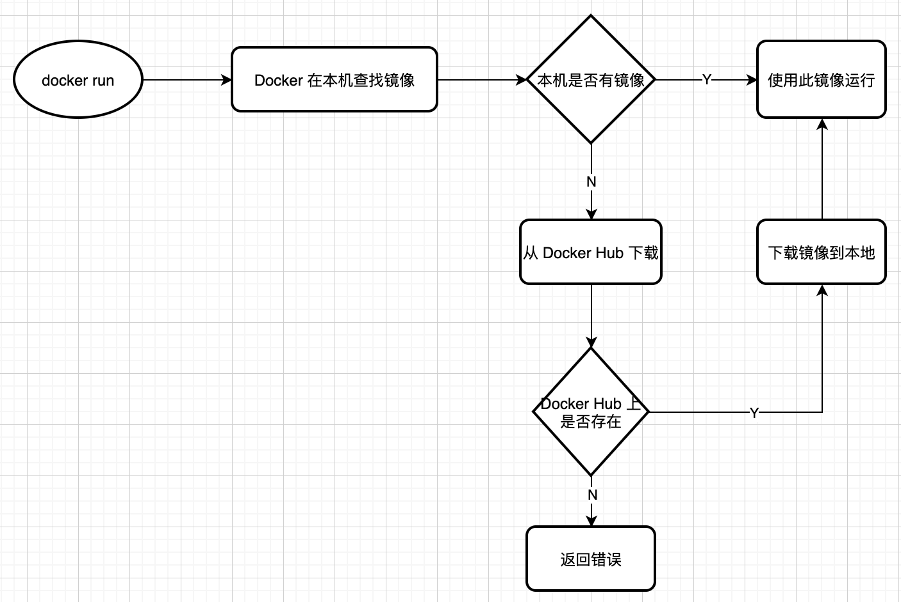
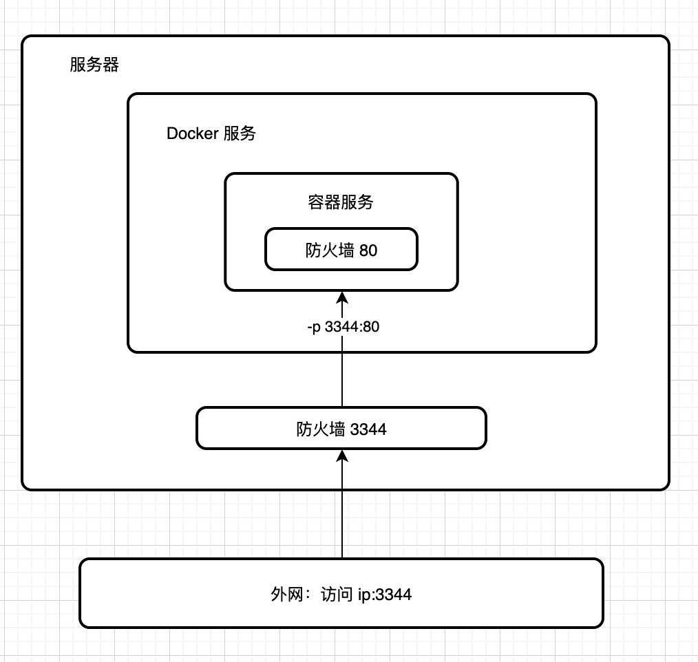
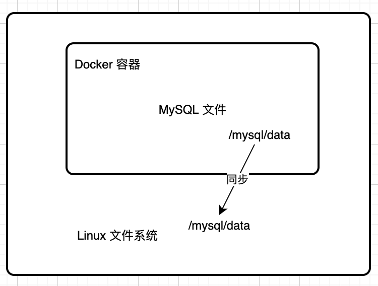
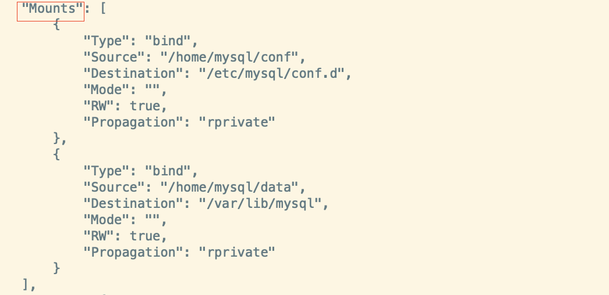

## Dcoker 介绍

Docker 是一个开源的应用容器引擎，而一个容器其实是一个虚拟化的独立的环境，让开发者可以打包他们的应用以及依赖包到一个可移植的容器中，然后发布到任何流行的 Linux 机器上，也可以实现虚拟化。容器是完全使用沙箱机制，相互之间不会有任何接口。

### Docker 优势

- 持续集成：Docker 可以通过确保从开发到产品发布整个过程环境的一致性。（**更快速的交付和部署**）
- 可移植性：Docker 容器能够很容易地移植到不同的平台上。
- 隔离性：Docker 可以确保应用程序与资源是分隔开的，每个容器都拥有自己的资源，并且和其他容器是隔离的，所以可以确保在删除容器时应用程序会被完全清除。（**更简单的系统运维**）
- 安全性：由于 Docker 容器是隔离的，并且资源是受限制的，所以即使其中一个应用程序被黑，也不会影响运行在其它 Docker 容器上的应用程序。

### Docker 和虚拟机的不同

- 虚拟机是虚拟出一套硬件，运行一个完整的操作系统，占用资源多，启动慢；
- 容器内的应用程序是直接运行在宿主机的内核上，容器本身没有自己的内核，也没有虚拟出硬件，故比较轻量；
- 容器之间是相互隔离的，每个容器内都有属于自己的文件系统，并互不影响；
- Docker 是内核级别的虚拟化，可以在一个物理机上运行多个容器实例。

### Docker 架构


### Docker 基本组成

- **镜像(Image)**：Docker 镜像相当于一个模板，可以通过这个模板来创建容器服务。
- **容器(Container)**：容器可以理解为一个简易的 Linux 系统，里面可以运行一个或一组应用。
- **仓库(Repository)**：仓库就是存放镜像的地方；分为公有仓库（Docker Hub）和私有仓库。


## Docker 安装

官方文档：https://docs.docker.com/engine/install/centos/

### 环境准备
1. CentOS 7（`cat /etc/os-release` 查看版本号）
2. 内核系统 3.0 以上（`uname -r` 查看系统内核）

### 安装

1. 卸载旧版本
```shell
sudo yum remove docker \
                  docker-client \
                  docker-client-latest \
                  docker-common \
                  docker-latest \
                  docker-latest-logrotate \
                  docker-logrotate \
                  docker-engine
```

2. 安装 yum 软件包
```shell
yum install -y yum-utils
```

3. 设置镜像源
```shell
sudo yum-config-manager \
    --add-repo \
    http://mirrors.aliyun.com/docker-ce/linux/centos/docker-ce.repo
```
>https://download.docker.com/linux/centos/docker-ce.repo (默认镜像地址，比较慢)

4. 更新 yum 软件包索引
```shell
yum makecache fast
```

5. 安装 docker 引擎
```shell
sudo yum install docker-ce docker-ce-cli containerd.io
```
6. 启动 docker
```shell
sudo systemctl start docker
sudo systemctl enable docker # 设为开机启动
```
7. 查看 docker 版本
```shell
sudo docker version
```


8. 查看下载的镜像
```shell
sudo docker images
```

### 卸载 docker

1. 卸载依赖
```shell
sudo yum remove docker-ce docker-ce-cli containerd.io
```

2. 删除资源
```shell
sudo rm -rf /var/lib/docker # docker 默认工作路径
sudo rm -rf /var/lib/containerd
```


## Docker 相关原理

**docker run 命令流程**




**Docker 是怎么工作的？**

Docker 是一个 Client-Server 结构的系统，它的守护进程运行在主机上，通过 Socket 从客户端访问。DockerServer 接收到 DockerClient 的指令，就会执行这个命令。

**Docker 为什么比虚拟机快？**

1. Docker 有着比虚拟机更少的抽象层
由于 Docker **不需要 Hypervisor 实现硬件资源虚拟化**，运行在 Docker 容器上的程序直接使用的是实际物理机的硬件资源，所以 Docker 在 CPU 和内存利用率上更有效率。

2. Docker 利用的是宿主机的内核，而不像虚拟那样需要 Guest OS
当新建一个容器时，Docker 不需要和虚拟机一样重新加载一个操作系统，避免了引导、加载操作系统内核这个比较费时费资源的过程；当新建一个虚拟机时，虚拟机软件需要加载 Guest OS，这个新建过程是分钟级别的，而 Docker 由于直接利用宿主机的操作系统则省略了这个过程，因此新建一个 Docker 容器只需要几秒钟。

Docker 与 VM 抽象层对比图：
_
            

## Docker 常用命令

官方文档：https://docs.docker.com/engine/reference/commandline/docker/

### 帮助命令
```shell
docker version    # 显示 docker 版本信息
docker info       # 显示 docker 的系统信息，包括镜像和容器的数量
docker 命令 --help  # 帮助命令
```

### 镜像命令
```shell
docker images         # 查看本地主机上的所有镜像；可选项：-a[全部]，-q[只显示 ID]
docker search <镜像名> # 搜索镜像；可选项：-f STARS = 3000
docker pull <镜像名: tag> # 拉取镜像，分层下载
docker rmi -f <容器 ID>  # 删除指定镜像
docker rmi -f $(docker images -aq) # 删除所有镜像
docker commit -m="message" -a="author" <容器 ID>  容器tag
```

### 容器命令

**新建并启动容器**
```shell
docker run [可选项] 镜像名称

# 可选项
 --name="Name"    设置容器名称
 -d               以后台方式运行
 -it              使用交互方式运行，进入容器内部
 -p               指定容器端口号；[主机端口号:容器端口号]
 -P               随机指定端口号
```

**列出运行的容器**
```shell
docker ps  # 列出正在运行的容器

# 可选项
-a     列出正在运行+历史运行的容器
-q     列出正在运行的容器编号
```

**退出容器**

```shell
exit   # 直接退出
Ctrl + P + Q # 容器不停止退出
```

**删除容器**   
```shell
docker rm  容器id     # 删除指定容器；不能删除正在运行的容器
docker rm -f $(docker ps -aq)   # 删除所有停止的容器
docker container prune # 删除所有停止的容器
docker ps -a -q | xargs docker rm  # 删除所有容器
```

**启动和停止容器**
```shell
docker start 容器id   # 启动容器
docker restart 容器id  # 重启容器
docker stop  容器id    # 停止容器
docker kill 容器id   # 强制停止容器
```

### 其他命令

**后台启动容器**      
```shell
docker run -td centos

docker run -td nginx sh -c  "nginx -c /etc/nginx/nginx.conf && nginx -s reload | tail -f /dev/null"  # 使用 sh -c 后面的参数覆盖 Dockerfile 中 CMD 的参数

docker run -td nginx sh -c  "nginx -c /etc/nginx/nginx.conf  | nginx -s reload"

# 使用 docker ps -a 发现 centos 停止；
# 原因：docker 容器使用后台运行时，必须要有一个前台进程，否则 docker 发现没有应用，就会自动停止。
```

**查看日志**
```shell
docker logs -tf --tail 100 容器id

# 参数解释
 -t   # 显示时间
 -f   # 跟随日志输出
 --tail N # 显示日志最后 N 条数
```

**查看容器进程信息**
```shell
docker top 容器id
```

**查看镜像元数据**
```shell
docker inspect 容器id
```

**进入正在运行的容器**
```shell
docker exec -it  容器id  bashShell / sh

# docker exec  # 进入容器后开启一个命令终端，可以在里面操作
# docker attach  # 进入容器正在执行的终端，不会启动新的进程
```

**容器内拷贝文件到主机**
```shell
docker cp 容器id:容器内路径  目的主机路径
```
**查看 cpu 状态**
```shell
docker stats_
            
```

 

## Docker 端口映射



**描述**：通过外网访问 `ip:3344` 地址，请求通过防火墙 3344 端口，访问到服务器，由于 3344 端口映射到容器的 80 端口，所以请求最终访问到容器的 80 端口所在服务。_
            

## Docker 镜像          

### 什么是镜像

镜像是一种轻量级、可执行的独立软件包，用来打包软件运行环境和基于运行环境开发的软件，它包含运行某个软件所需要的内容，包括代码、运行时、库、环境变量和配置文件。

### 镜像加载原理

Docker 的镜像实际上是由一层一层的文件系统组成的，这种层级的文件系统叫作**联合文件系统(UnionFS)**。

镜像内部分为两部分：

- bootfs(boot file system)：Docker 镜像的最底层是 bootfs，主要包含 bootloader（加载器）和 kernel（内核）。bootloader 主要是引导加载 kernel，Linux 刚启动时会加载 bootfs 文件系统。这一层与典型的 Linux/Unix 系统一样，包含bootloader 和 kernel。

- rootfs(root file system)：在 bootfs 之上，包含的就是典型 Linux 系统中的 /dev、/proc、/bin、/etc 等标准目录和文件。
rootfs 就是各种不同的操作系统发行版，比如 Ubuntu、Centos 等等。

**镜像加载过程**：先加载 bootfs，当 bootfs 加载完成后，整个内核就在内存中了，此时内存的使用权已由 bootfs 转交给了内核，此时系统也会卸载 bootfs（这里的加载可以理解为 windows 电脑开机时候，从黑屏到进入操作系统的过程）。然后，加载 rootfs， rootfs 可以很小，只需要包括最基本的命令、工具和程序库就可以了，因为底层用 Host 的 kernel。


**思考**

- 为什么安装进虚拟机中的 CentOS 有好几个 G，而 Docker 中的 CentOS 就只有几百 M？
  因为 Docker 底层直接使用用主机的内核，自己只需要提供 rootfs 就行了，而 rootfs 一般很小，只包含最基本的命令、工具和程序库。_
              

## 容器技术基石：联合文件系统

Union File System，简称 Union FS，是一种分层、轻量级并且高性能的文件系统，它可以把其他文件系统联合挂载到同一个虚拟文件系统下，简而言之就是把多个目录（可能对应不同的文件系统）挂载到同一个目录，对外呈现这些目录的联合。

Union FS 不是一种底层文件系统，无法独立于其他文件系统而存在。它用分支把不同文件系统的文件和目录“透明地”覆盖，形成单个一致的文件系统。联合文件系统具有隔离功能，因为容器对共享镜像层具有只读访问权限。如果它们需要修改任何只读共享文件，它们会使用**写时复制(Copy-on-Write)**策略将内容复制到可以安全修改的可写层。

**写时复制（Copy-on-Write）**：也叫隐式共享，是一种对可修改资源实现高效复制的资源管理技术。它的思想是，如果一个资源是重复的，那么这个资源可以被多个实例共享，而不需要立即创建一个新的资源副本，当需要对资源进行修改的时候，才进行复制，并在复制后的副本上进行修改。通过这种资源共享的方式，可以显著地减少未修改资源复制带来的消耗，但是也会在进行资源修改时增加小部分的开销。

Docker 目前支持的联合文件系统包括 OverlayFS、AUFS、Btrfs、VFS、ZFS 和 Device Mapper。overlay2 是目前 Docker 默认的存储驱动，以前则是 AUFS。


 ## 容器数据卷

由于容器中产生的数据，在容器删除后就会丢失，所以数据卷技术就出现了。它是一种能让容器中产生的数据，同步并持久到本地，本地的数据也能同步到容器的技术（类似双向绑定，但是容器删除了，本地数据不会丢失）。简单地讲就是，可以将容器内的目录挂载到服务器上面，同时容器间可以共享此目录，即数据共享。

**数据卷**是被设计用来持久化数据的，它的生命周期独立于容器，Docker 不会在容器被删除后自动删除数据卷，并且也不存在垃圾回收这样的机制来处理没有任何容器引用的数据卷。



### 数据卷使用

使用命令 -v 挂载

**1. 指定路径挂载**

```shell
# 启动一个挂载数据卷的容器
docker run -d -v /home/test:/home/test centos
```
使用 Docker 进行安装 MySQL 数据库进行测试：
```shell
docker run -d -p 3309:3306 -v /home/mysql/data:/var/lib/mysql -v /home/mysql/conf:/etc/mysql/conf.d -e MYSQL_ROOT_PASSWORD=123456 --name mysql02 mysql:5.7
```
使用 `docker inspect` 命令可以查查容器的挂载信息：



**2. 具名挂载**
```shell
docker run -d -P -v nginx-data:/etc/nginx --name nginx01 nginx
```

**3. 匿名挂载**

```shell
docker run -d -P -v /etc/nginx --name nginx01 nginx
```

使用 `docker volume ls` 可以查看所有的数据卷名称：


使用 `docker volume inspect <数据卷名 >` 可以查看数据卷实际挂载的地址：


### 数据卷删除

```shell
docker volume rm <数据卷名>  # 删除指定数据卷
docker volume prune      # 删除无主的数据卷
docker rm -v <容器 ID>  # 删除容器的同时移除数据卷
```

### 数据卷容器

```shell
docker run -it --name centos02 --volumes-from centos01 centos  # centos02 共享 centos01 的数据卷，容器间数据是双向拷贝
                        
```


## Dockerfile

官方文档：https://docs.docker.com/engine/reference/builder/

Dokcerfile 是用来构建 Docker 镜像的文件，是一种命令参数脚本。

### Dockerfile 指令


**FROM**

尽可能使用当前官方仓库作为你构建镜像的基础。推荐使用 [Alpine](https://hub.docker.com/_/alpine/)镜像，因为它被严格控制并保持最小尺寸（目前小于 5 MB），但它仍然是一个完整的发行版。

**RUN**

为了保持 Dockerfile 文件的可读性，可理解性，以及可维护性，建议将长的或复杂的 RUN 指令用反斜杠 \ 分割成多行。

**ADD 和 COPY**

虽然 ADD 和 COPY 功能类似，但一般优先使用 COPY。因为它比 ADD 更透明。COPY 只支持简单将本地文件拷贝到容器中，而 ADD 还支持**本地 tar 提取（自动解压缩）**和**通过 URL 从远程服务器读取资源并复制到镜像中**。因此，**ADD 的最佳用例是将本地 tar 文件自动提取到镜像中**，例如 `ADD rootfs.tar.xz`。

**CMD 和 ENTRYPOINT 区别**

- 每个 Dockerfile 只能有一条 CMD 命令，如果指定了多条命令，只有最后一条会被执行。如果启动容器时，手动指定了运行的命令（作为 run 的参数），则会覆盖掉 CMD 指定的命令。
- 每个 Dockerfile中 只能有一个 ENTRYPOINT，当指定多个时，只有最后一个有效。如果启动容器时，手动指定了运行的命令（作为 run 的参数），则是在 ENTRYPOINT 指定的命令后进行追加，但是可以被 --entrypoint 参数覆盖掉。


### 构建镜像

构建一个 CentOS 镜像

- Dockerfile 编写
```txt
FROM centos
LABEL author="star"

RUN yum -y install vim
RUN yum -y install net-tools

EXPOSE 80

CMD echo "---end---"
CMD /bin/bash
```

- 构建命令
```shell
docker build -f mydockerfile -t mycentos:1.0 .  # 在当前目录下构建名为 mycentos:1.0 的镜像，注意最后的 “.” 不能省略。
```

### 发布镜像

DockerHub 地址：https://hub.docker.com/

- 登录 DockerHub
```shell
docker login -u starzheng  # 使用 DockerID starzheng 进行登录，后面会提示输入密码
docker login -u <UserID> <仓库地址> # 登录指定 Docker 仓库，默认是 DockerHub
```
- 推送镜像
```shell
docker push starzheng/centos:1.0
```

**常见问题**

1. **An image does not exist locally with the tag: starzheng/mycentos**
解决方案：将本地镜像打上指定 Tag。命令如下：
```shell
docker tag <镜像 ID> <tag> #  示列：docker tag fbb399df2633 starzheng/mycentos:1.0
```

### 小结
_
            

## Docker 网络

### docker0 网桥

Docker 服务启动时，会自动在宿主机上创建一个 docker0 虚拟网桥（桥接模式，使用 veth-pair 技术），它在内核层连通了其他的物理或虚拟网卡，这就将所有容器和本地主机都放到同一个物理网络。

Docker 启动一个容器时会根据 docker0 的网段分配给容器一个 IP 地址，称为 Container-IP。同时 docker0 是每个容器的默认网关。因为在同一宿主机内的容器都接入同一个 docker0 网桥，所以容器之间就能够通过容器的 IP 直接通信，并容器可以通过 docker0 网桥与外界通信。（Docker 启动容器时，默认使用的是 Bridge 模式）

Docker 中所有的网络接口都是虚拟，虚拟网卡转发效率高。

**veth-pair**
veth-pair 就是一对的虚拟设备接口，和 tap/tun 设备不同的是，它都是成对出现的。一端连着协议栈，一端彼此相连着。veth-pair 充当一个桥梁，连接各种虚拟网络设备。

正因为有 veth-pair，docker 容器与容器之间是可以相互 ping 通的，Linux 与 docker 容器之间通过 docker0 是可以 ping 通的。

docker bridge 网络模式图：


docker0 网桥上的 veth 网卡设备相当于交换机上的端口，可以将多个容器连接在它们上面。docker0 网桥为连在其上的容器转发数据帧，使得同一台宿主机上的 docker 容器之间可以相互通信。

### 自定义网络
自定义网络可以实现容器互联，可以直接使用容器名（相当于 HostName）进行 ping 通。

```shell
docker network ls  # 查询 Docker 网络模式
docker network inspect <network id> # 查看 Docker 网络元信息
docker network create --driver bridge --subnet 192.168.0.0/16 --gateway 192.168.0.1 mynet  # 自定义网络 mynet
```

### 网络连通

当两个容器处在不同网段时，可以使用如下命令进行连通：

```shell
docker network connect NETWORK CONTAINER
```

### Docker 网络模式

Docker 网络模式有四种：
- bridge 模式
- host 模式
- container 模式（不常用）
- none 模式


**bridge 模式**

Docker 启动容器时，默认使用的网络模式就是 bridge 模式。网络拓扑图：


**Docker 容器与外界通信过程**：启动 Docker 服务时，默认会给宿主机添加 iptables 规则，用于容器与外界进行通信。我们可以通过 iptables-save 命令查看到 iptabales 的规则信息，如下图：


其中，nat 表上 POSTROUTING 链上的有这么一条规则：
```shell
-A POSTROUTING -s 172.17.0.0/16 ! -o docker0 -j MASQUERADE
```
其含义是将不是从网卡 docker0 发出的且源地址为 172.17.0.0/16 的数据包(容器中发出的数据包)做 SNAT。这样一来，从 docker 容器中访问外网的流量，在外部看来就是从宿主机上发出的，外部感觉不到 docker 容器的存在。

当外界想要访问 docker 容器运行的服务时，也是通过 iptables 规则，如下：
```shell
-A DOCKER ! -i docker0 -p tcp -m tcp --dport 8090 -j DNAT --to-destination 172.17.0.2:8080
```
其含义是将访问宿主机 8090 端口的请求转发到 172.17.0.2 的 8080 端口上(提供服务的 Docker 容器的 IP 和端口)，所以外界访问 Docker 容器是通过 iptables 做 DNAT 实现的。

在 Docker 容器和外界的通信过程中，还涉及了数据包在多个网卡之间的转发(比如从 docker0 网卡到宿主机 eth0 网卡)，这需要内核将 ip 转发功能打开，就是把内核参数 ip_forward 设置为 1。Docker daemon 在启动的时候会执行这个操作，我们可以通过下面的命令进行检查：
```shell
cat /proc/sys/net/ipv4/ip_forward
```
关于 ip 转发功能如何开启，可以见：[Docker：容器内无法解析 DNS 问题](https://github.com/yifanzheng/solution-collection/issues/10#issue-1021632294)

**host 模式**

host 模式下启动的容器，网络不再与宿主机隔离，访问容器服务可以直接使用访问宿主机对应的网络端口，且不需要端口转发，性能比较好。但 host 模式也有非常严重的缺点：**容器没有隔离的网络，会与其他服务竞争宿主机的网络，导致宿主机网络状态不可控，因此无法用在生产环境**。

网络拓扑图：

            